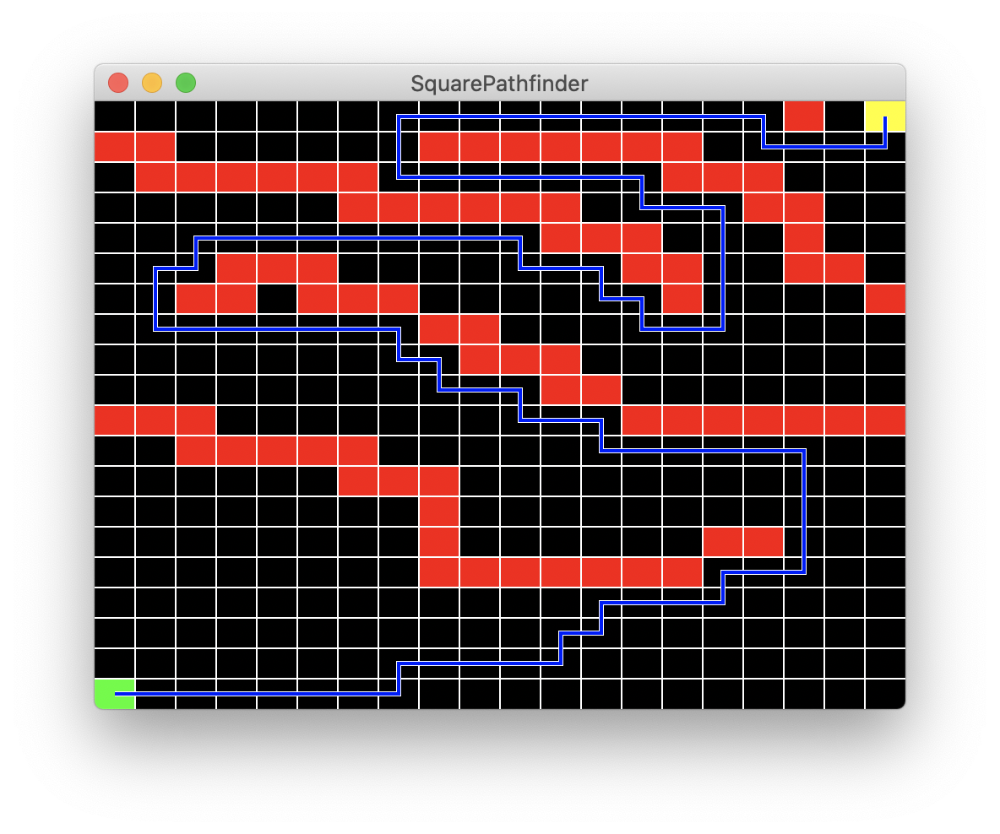
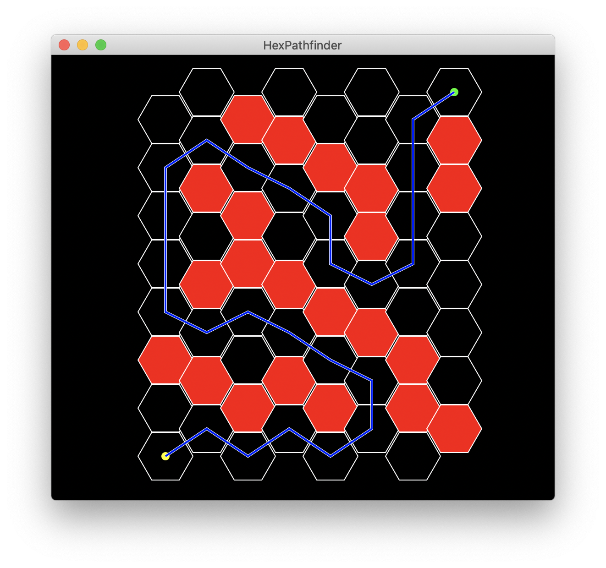
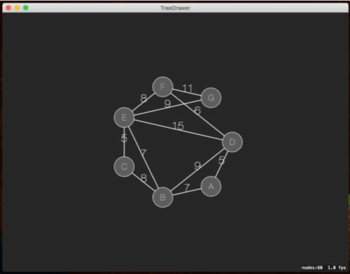

# SwiftAlgorithmsDemos
Demos of the algorithms published in SwiftAlgorithms

## SquarePathfinder
Searches for a path between two points on a square grid using the A* algorithm provided by [SwiftAlgorithms](https://github.com/brend/SwiftAlgorithms).

Command-click and Control-click to change the position of the points; click without modifiers to create/remove barriers.

## HexPathfinder 
Searches for a path between two points on a hexagonal grid using the A* algorithm provided by [SwiftAlgorithms](https://github.com/brend/SwiftAlgorithms).

Command-click and Control-click to change the position of the points; click without modifiers to create/remove barriers.

## TreeDrawer
Computes a minimum spanning tree for a given graph, and animates a transformation between the graph and the tree.

